# 🎬 Flash童年放映机

一款专为移动端打造的 Flash 及 HTML5 游戏本地播放与外设模拟工具，支持自定义虚拟按键、手柄映射及网页搜索功能，让你随时重温童年经典。

感谢各位小伙伴的反馈与支持，经过这么多版本的迭代，放映机目前的功能也已经相对完善了，你可以通过[百度](https://pan.baidu.com/s/1EYta9vYiLSb-fT6EEoqO7g?pwd=tr1k )、[夸克](https://pan.quark.cn/s/04cb1f13b2ca)或者github来下载体验

---

## 📑 目录

* [应用预览](## 📱 应用预览)
* [主要功能](## ✨ 主要功能)
* [使用说明](## 📖 使用说明)
  * [1. 载入游戏](#1-载入游戏)
  * [2. 按键设置与管理](#2-按键设置与管理)
  * [3. 网页搜索功能](#3-网页搜索功能)
  * [4. 游戏键盘](#4-游戏键盘)
  * [5. 硬件映射](#5-硬件映射)
* [问题](#问题)
---

## 📱 应用预览

  
   
  <b>App 图标</b>

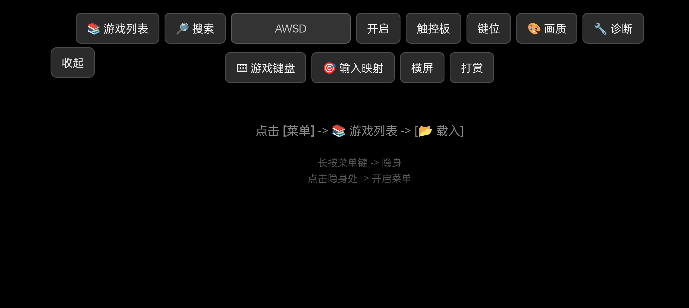
*App 首页*

---

## ✨ 主要功能

* **广泛兼容**：支持多文件的 Flash 游戏以及 HTML5 游戏播放。
* **自由定制**：支持高度自定义按键和键位布局，适配不同游戏需求。
* **独立工具**：可作为独立的虚拟游戏键盘悬浮使用。
* **外设拓展**：支持硬件映射（例如物理手柄），带来更佳操作手感。
* **在线游玩**：内置网页搜索功能，方便直接寻找并游玩在线 Flash 资源。

---

## 📖 使用说明

### 1. 载入游戏
点击**游戏列表**菜单，会弹出如下图所示的列表框：

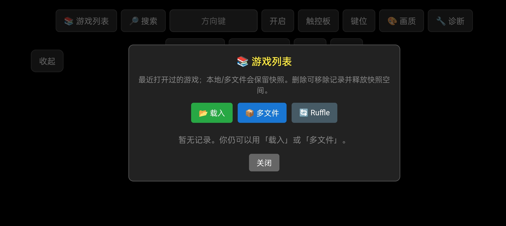

* **载入**：用于加载单个 Flash 游戏文件（如 `.swf`）。
* **多文件**：用于加载包含多个依赖文件的复杂 Flash 游戏包。
* **Ruffle**：内置 Ruffle 自托管包管理，你可以在此自行更新最新版的 Ruffle 托管包。

### 2. 按键设置与管理

#### 开启按键
在**方向键**菜单栏旁边有一个**开启**菜单栏。点击“开启”即可打开或关闭虚拟按键。*(注：下图为按键处于开启状态)*
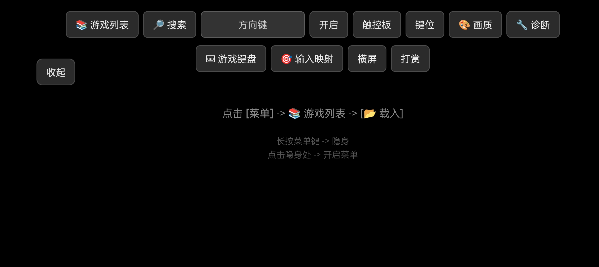
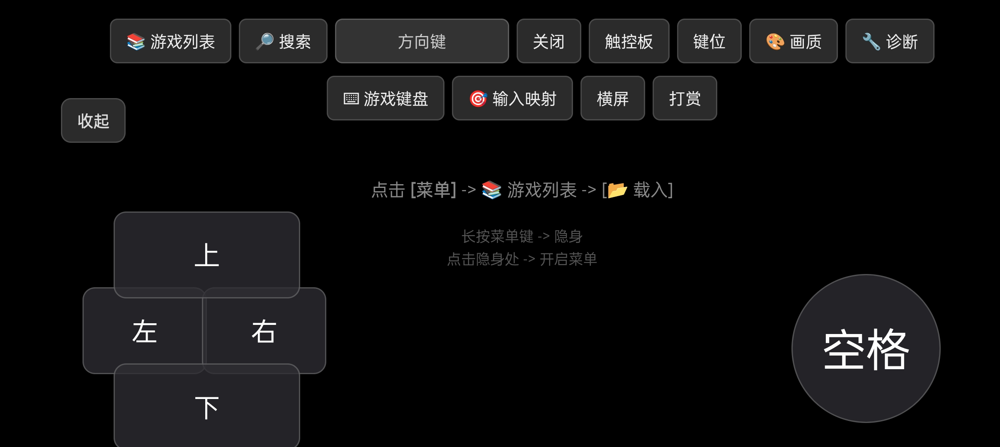

#### 切换按键方案
点击**方向键**菜单栏，将弹出按键方案列表框：
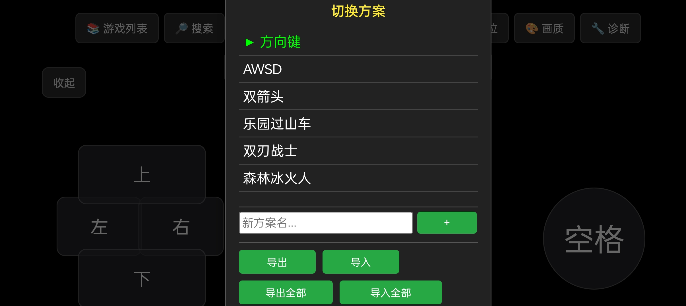
* 播放器已内置几套常用按键方案，点击对应的名称即可直接切换。
* **删除方案**：长按不需要的方案名称即可将其删除。

#### 添加新的按键方案
想要创建新方案，请在列表的**白色输入框**中填入你的方案名称，然后点击旁边的 **`+`** 号即可创建。
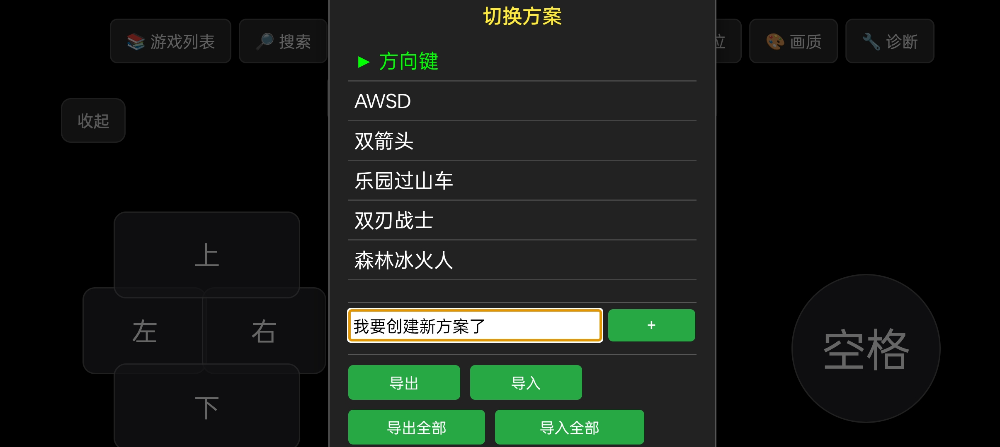
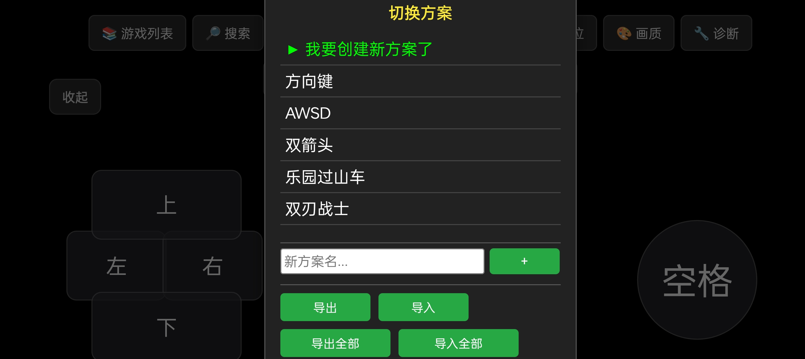
> **💡 提示**：新建的方案不会是完全空白的，它会自动继承你上一次选中的方案布局，方便你在此基础上进行调整。

#### 按键编辑
若要对新建或原有的方案进行修改，请点击**键位**菜单，唤出键位工具列表：
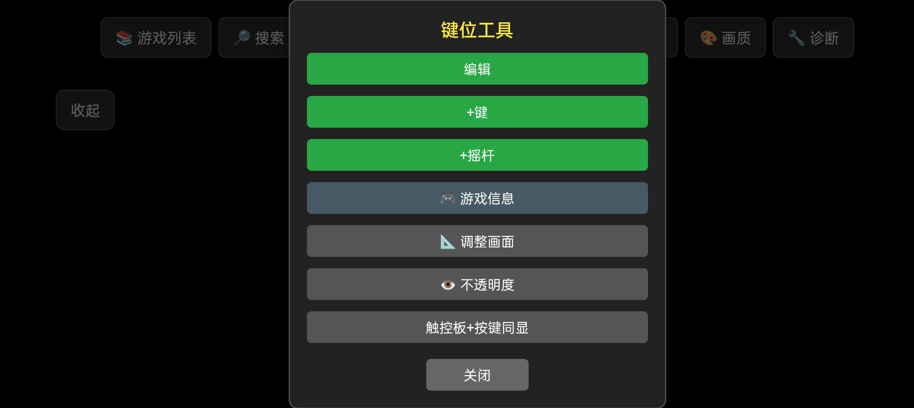

1. **进入编辑模式**：点击“编辑”选项，按键外围会出现可编辑的虚线框。此时你可以自由拖动或点击按键进行调整。
   *(⚠️ 注意：点击编辑前请务必先“开启按键”，否则你将看不到按键实体)*
2. **修改按键**：在编辑模式下，点击对应按键会弹出编辑框：
   * **名字**：按键上显示的文字标识。
   * **功能**：对应的实际键盘按键（例如你想要 `A` 键，输入 `a` 即可）。
   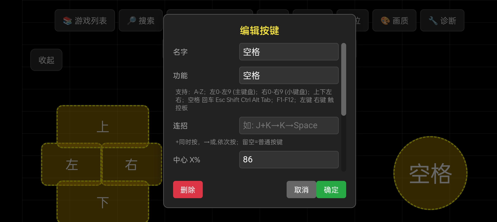
3. **添加按键**：使用键位工具列表下方的 **`+`** 键可向屏幕添加新的按键。
4. **保存并退出**：编辑完成后，**必须回到键位工具列表点击“完成”**，否则系统会一直停留在编辑状态。
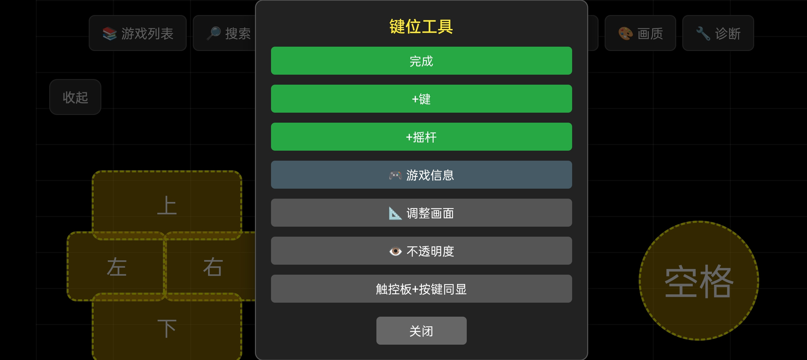

**附：按键功能键码参考表**
配置按键“功能”时，可参考以下键码表输入对应的值：
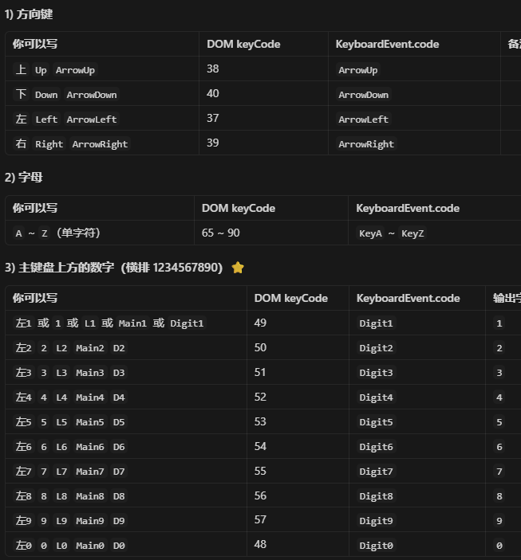
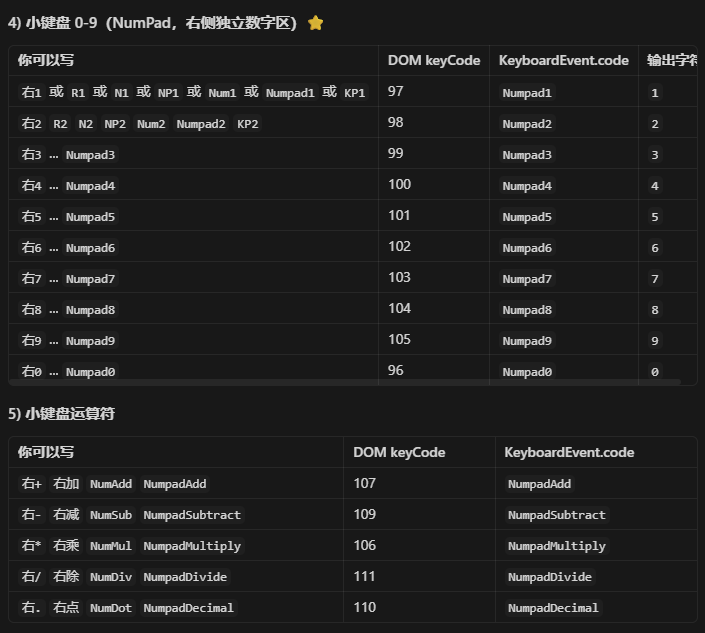
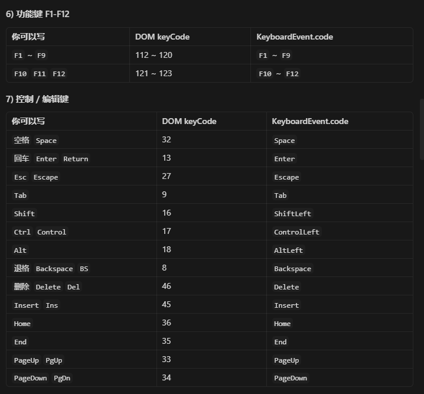

---

### 3. 网页搜索功能
如果你本地没有游戏文件，可以通过播放器内在的网页直接游玩在线 Flash 游戏。
点击**搜索**菜单唤出搜索栏，在对话框中输入对应的网址或关键词即可导航。
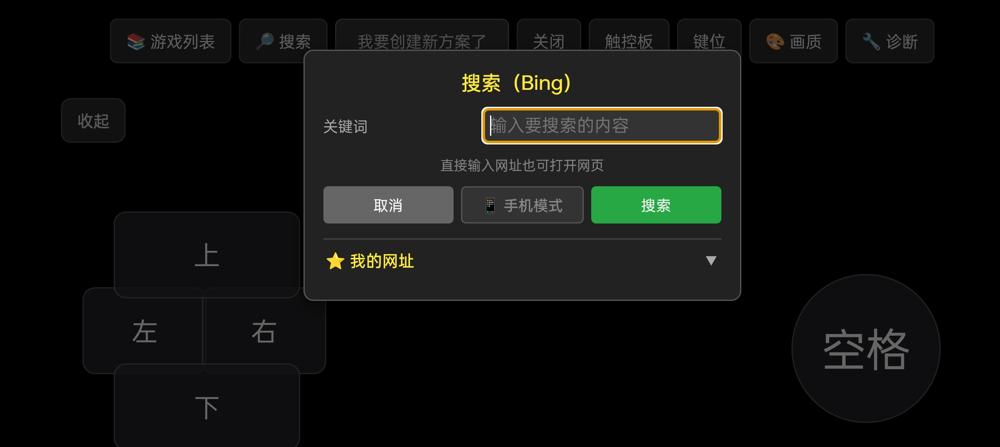

**如何在网页中开启菜单按键：**
1. 找到一个使用 Ruffle 播放的 Flash 小游戏，**长按游戏画面**弹出信息框（部分拥有全屏按钮的网页点击全屏效果相同）。
2. 点击**进入全屏**。
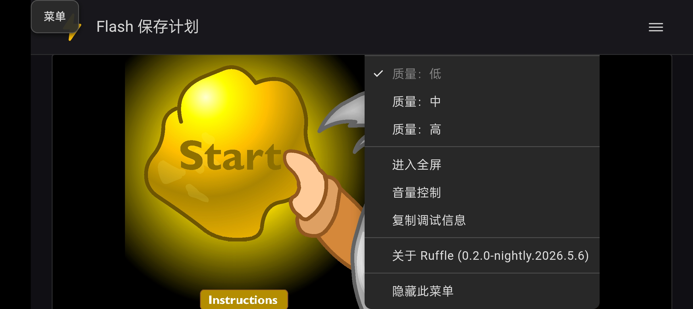
3. 此时会弹出播放器的系统菜单栏，点击**开启按键**即可开始游玩。
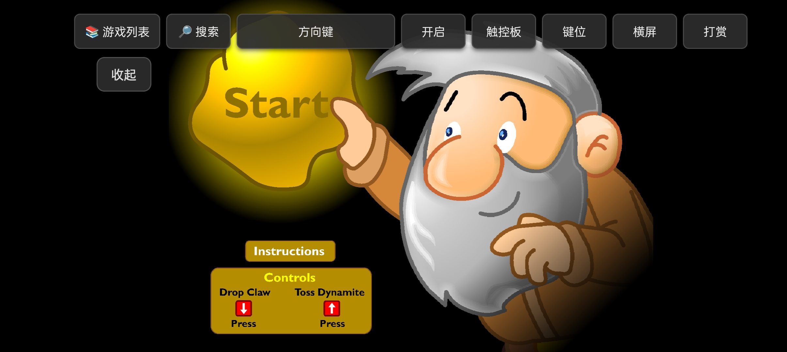

> **⚠️ 注意事项**
> 播放器内置的网页浏览功能无法像手机浏览器那样额外安装 Ruffle 插件。因此，对于本身**没有集成 Ruffle**的 Flash 游戏网站（例如早期的 4399 架构），播放器是无法直接运行其中的 Flash 小游戏的。

---

### 4. 游戏键盘
如果你正在使用已安装了 Ruffle 插件的第三方移动端浏览器（例如用来玩 4399 或 HTML5 游戏），可以将本应用作为悬浮的**游戏键盘**来配合使用。
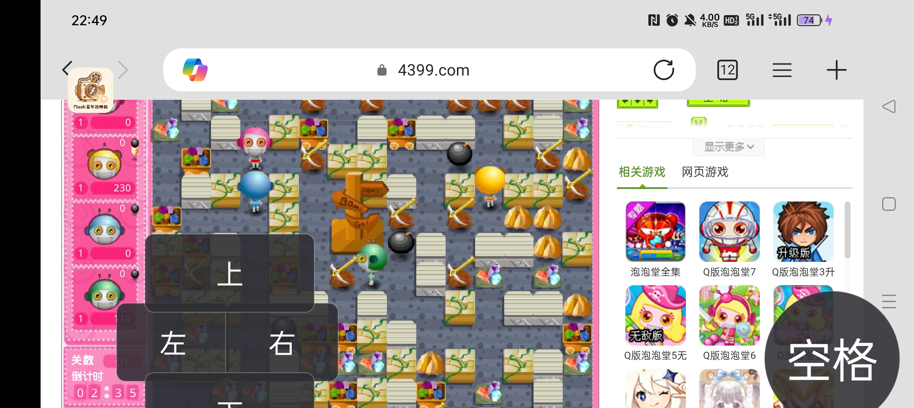

### 5. 硬件映射
应用支持物理外设接入。你可以连接手柄等硬件设备，并在应用内添加物理映射，获得更真实的游戏操作反馈。
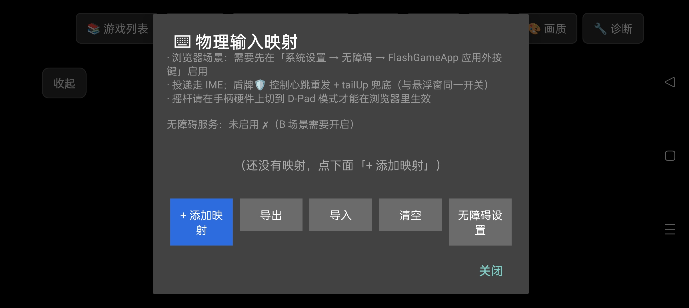

---

# 问题
